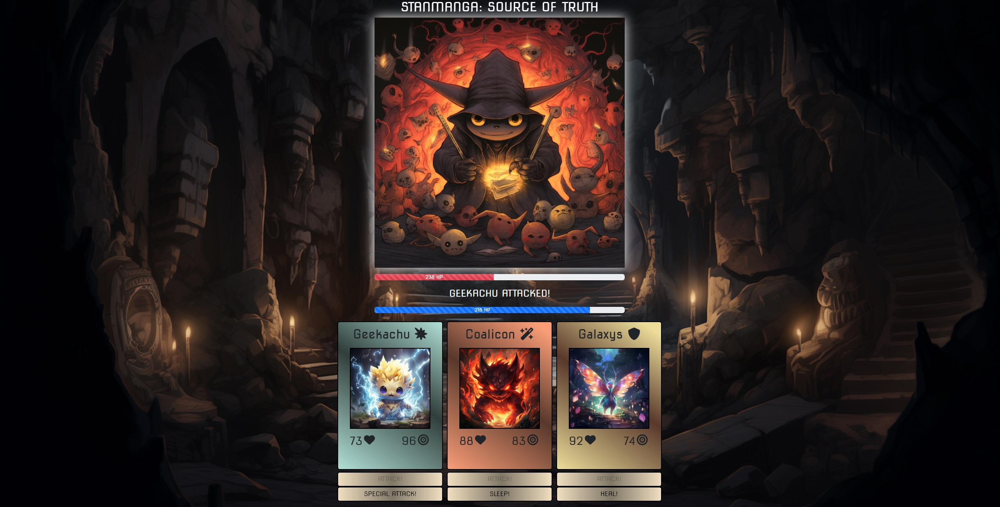

# Prográmon Palace


## Description
Welcome to Team SCCRM's Prográmon Palace, a Creature-Battler Card Game built with the MERN stack. Immerse yourself in a mythical world where your collection of powerful creatures face off against terrible foes in epic combat! Prográmon Palace leverages MongoDB and Express to support discrete user accounts and card trading features, React's state management system for complex realtime interactions, and MidJourney's generative image AI for rapid deployment of creature art assets. The project aims to establish a scaleable baseline for what could eventually be built into an entertaining and feature-rich gaming product.

**Deployed Link:**  https://programon-palace.onrender.com/

## Table of Contents
- [Log In](#login)
- [Marketplace](#marketplace)
- [Trading](#trading)
- [Lobby](#lobby)
- [Combat](#combat)
- [Credits](#credits)
- [License](#license)

## Login


To get started with Prográmon Palace, follow these steps:
- Select "Log In" from the main menu screen.
- Input your login credentials.
- If you are new to the Palace, select "Sign Up" and create a new account.
- If you would prefer to use our demo account, log in using the following credentials:  

    ```Username: AshKetchum || Password: missingno```
---

## Marketplace


Here you can find new creatures to add to your deck!
- In this demo version of the game, four new cards become available every 30 seconds.
- If you have enough coin, simply press the "Purchase" button to obtain the card of your choice.
- If you find your wallet is a little light, you'll need to head for the Palace to collect more treasure!
---

## Trading


**Completing Trades:**

- The trade board allows you to browse current trade offers created by other players.
- If you are eligible for a trade, select "Complete Trade" to swap creatures.
- If you are not eligible for any trades, check the Marketplace. Perhaps you can find the card you need!


**Creating Trade Offers:**

- You can create your own trade offers in the "My Deck" screen.
- First, select "Offer Trade" for the Prográmon you'd like to offer.
- Next, select the Prográmon you'd like in return.
- Congratulations, you've created a trade offer! Be sure to check your deck regularly. If another player completes your offer, you may have a new friend waiting for you!
---

## Lobby


Before entering the Palace, you'll need to select a team of three Prográmon to bring with you.
- Choose your strongest Prográmon. Good Attack and Health stats can mean the difference between victory and defeat.
- There are three types of Prográmon: Attackers, Defenders, and Tricksters. Try to build a team that includes all three, as their special abilities will synergize in battle!
---

## Combat



It is said that untold treasures lie deep beneath Prográmon Palace. If those treasures are to be yours, you will have to face three Palace Guardians!
  
**Each Prográmon type has a different special ability:**
- Attackers can perform a Critical Hit. This deals massive damage to the enemy!
- Defenders can Heal your party, recovering precious HP needed to survive!
- Tricksters can put your enemy to sleep, leaving them vulnerable to attack!  

A good Prográmon team can win any battle. Try the following combo to improve your odds of success:
1. First, put your opponent to sleep with a Trickster. This will buy you time to take other actions.
2. Next, heal your team with a Defender. You wont have to worry about the enemy retaliating.
3. Finally, deal a Critical Hit with your Attacker.
4. If you're quick, you may have time for one more basic Attack before the Guardian wakes up. Make it count!

**Good luck in there, Adventurer!**
---

## Credits

- <a href="https://github.com/Bunde20">Steven Bunde</a>
- <a href="https://github.com/CambiG1123">Campbell Gilliland</a>
- <a href="https://github.com/ChrisDeHaan">Christopher DeHaan</a>
- <a href="https://github.com/RachelCodes42">Rachel Hochman</a>
- <a href="https://github.com/Elrond-Hubbard">Michael Marsolo</a>
---

## Technologies Used

**Frontend**

- React
- Vite
- Bootstrap
- animate.css
- Fontawesome

**Backend**

- Node
- Express
- MongoDB
- bcrypt.js (for password hashing)
- Axios
- cors (Cross-Origin Resource Sharing)
- JWT (JSON Web Tokens)
- MidJourney
---
## License
<!-- Add license badge and explanation here -->
[](https://opensource.org/licenses/MIT)